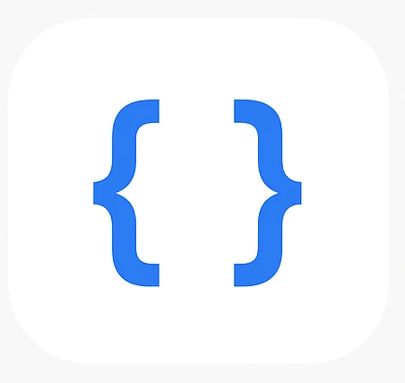

#  DevUnite

### **Uniting Developers Through Real-Time Collaboration & AI-Powered Learning**

*The open-source platform for interactive mentorship and pair programming.*

## 🚀 Overview

DevUnite is on a mission to break down the barriers to collaborative learning in software development. We build powerful, open-source tools that enable developers to code together in real-time, learn from each other, and accelerate their growth, regardless of their location or background.

We believe the future of coding education is interactive, communal, and intelligent.

## 📦 Core Project: The DevUnite Platform

The DevUnite Platform is our flagship application—a full-stack, real-time environment for collaborative coding and mentorship.

**🔗 Repository:** [devunite/platform](https://github.com/devunite/platform) | **Status:** `Active Development`

### ✨ Features

*   **Real-Time Collaborative Editor:** Code together with multiple users, featuring live cursors, text synchronization, and user presence.
*   **AI-Powered Assistant:** Get instant explanations, hints, and code reviews from an integrated AI tutor without leaving the editor.
*   **Session Management:** Create, save, and replay coding sessions with structured lesson plans.
*   **Progress Insights:** Visual dashboards to track learning progress and skill development over time.

### 🛠️ Tech Stack

The platform is built with a modern, robust, and scalable technology stack:

| Layer | Technology |
| :--- | :--- |
| **Frontend** | [Next.js 14](https://nextjs.org/) (App Router), [TypeScript](https://www.typescriptlang.org/), [Tailwind CSS](https://tailwindcss.com/) |
| **Backend API** | [FastAPI](https://fastapi.tiangolo.com/), [Python](https://www.python.org/) |
| **Realtime Engine** | [Liveblocks](https://liveblocks.io/) (WebSockets & CRDTs) |
| **Database** | [PostgreSQL](https://www.postgresql.org/), [Prisma](https://www.prisma.io/) ORM |
| **AI/ML** | [OpenAI API](https://openai.com/blog/openai-api) (GPT-4) |
| **Authentication** | [Next-Auth.js](https://next-auth.js.org/) |
| **Deployment** | [Vercel](https://vercel.com/) (Frontend), [Railway](https://railway.app/) (Backend/DB) |
| **DevOps** | [Docker](https://www.docker.com/), [GitHub Actions](https://github.com/features/actions) |

## 🤝 How to Contribute

We enthusiastically welcome contributions from developers of all skill levels. DevUnite is built by the community, for the community.

**We need help in all areas:**
*   🎨 UI/UX Design & Frontend (React, TypeScript, CSS)
*   ⚙️ Backend & API Development (FastAPI, Python)
*   🧠 AI Integration & Prompt Engineering
*   🐛 Bug Fixes, Documentation, and Testing

**Getting Started:**
1.  Fork the [`platform`](https://github.com/devunite/platform) repository.
2.  Check our issue tracker for [`good first issues`](https://github.com/devunite/platform/labels/good%20first%20issue) to find a place to start.
3.  Read our [Contributing Guidelines](CONTRIBUTING.md) and [Code of Conduct](CODE_OF_CONDUCT.md).
4.  Submit a Pull Request! We are happy to guide you.

## 📚 Learn More

*   **[Documentation](https://github.com/devunite/platform/wiki):** Explore our wiki for setup guides, architecture decisions, and API references.
*   **[Roadmap](https://github.com/orgs/devunite/projects/1):** View our public project roadmap and see what's next for DevUnite.
*   **Blog:** *[Coming Soon] Follow our journey and technical deep-dives.*

## 📫 Join the Community

*   **💻 Developer:** [Your Name](https://github.com/[your-username])
*   **🐦 Follow us on X (Twitter):** [@dev_unite](https://twitter.com/dev_unite) *- For announcements and updates*
*   **💬 Discussion & Help:** [GitHub Discussions](https://github.com/devunite/platform/discussions) *- The best place to ask questions and share ideas*

## 📄 License

All code in this organization is licensed under the permissive **MIT License**. See the [LICENSE](LICENSE) file for details.

---

**Let's build the future of developer collaboration, together.**

---
